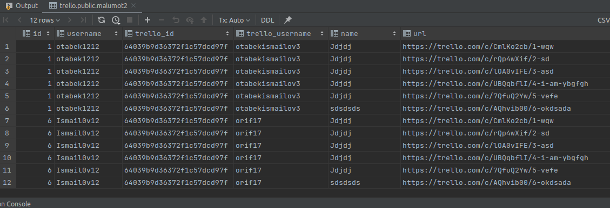

```sql
create or replace view malumot as
select u.id, u.username, b.trello_id, u.first_name
from users u
         inner join boards_users bu on u.id = bu.user_id
         inner join boards b on bu.board_id = b.id;
drop view malumot;

select *
from malumot m;
```

,

```sql
create or replace view malumot2 as
select u.id, u.username, b.trello_id, u.trello_username, l.name, c.url
from users u
         inner join boards_users bu on u.id = bu.user_id
         inner join boards b on bu.board_id = b.id
         inner join lists l on b.id = l.board_id
         inner join cards c on l.id = c.list_id
where b.id = 1;
drop view malumot2;

select *
from malumot2 m;
```

,